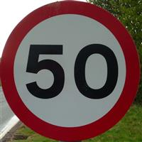

# Traffic sign classifier 
This repository uses pytorch and pytorch-lightning as the training frameworks.


### - ###




### GTSRB dataset:
`https://www.kaggle.com/datasets/meowmeowmeowmeowmeow/gtsrb-german-traffic-sign/download?datasetVersionNumber=1`

### Training the network:
```bash
python3 scripts/train.py --config  scripts/config.yaml
```

### Predict
use the notebook provided to predict traffic signs.

```bash
notebooks/predict.ipynb
```